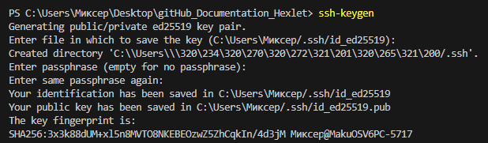
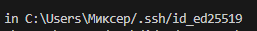

# Документация для быстрого доступа к базовой информации о пользовании ГитХабом.

## генерация публичного SSH ключа
``` bash
ssh-keygen
```

На последующие строчки нажимаем ENTER: 


Далее, вам бувдет показано, по какому пути был сохранён ваш публичный ключ


Для того, чтобы прочитать данный публичный ключ нам необходимо ввести следующую команду:
``` bash
cat ~/.ssh/id_ID_Вашего_Ключа.pub
```

И скопировать полностью следующую строчку

## ВАЖНО: НЕ СООБЩАЙТЕ НИКОМУ СВОЙ КЛЮЧ, ЭТО МОЖЕТ БЫТЬ ОПАСТНОСТИ ДЛЯ ЦЕЛОСТНОСТИ ВАШИХ ФАЙЛОВ НА ГИТХАБЕ!!!

