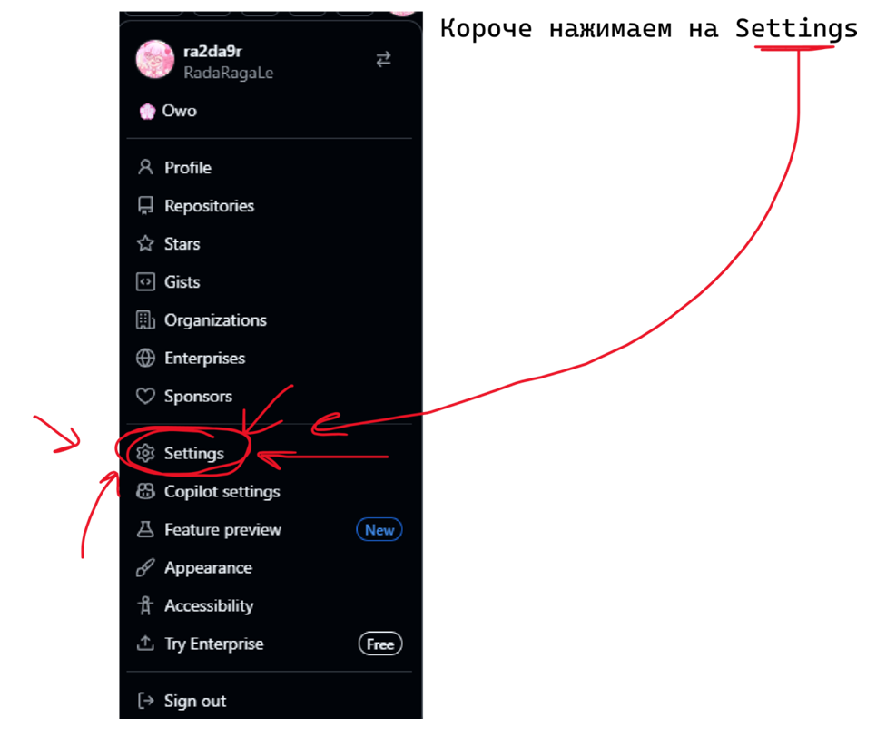
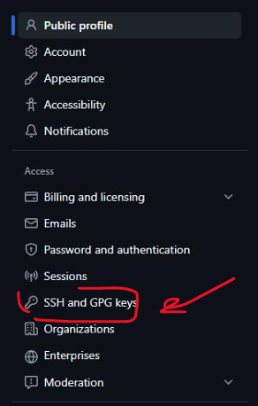
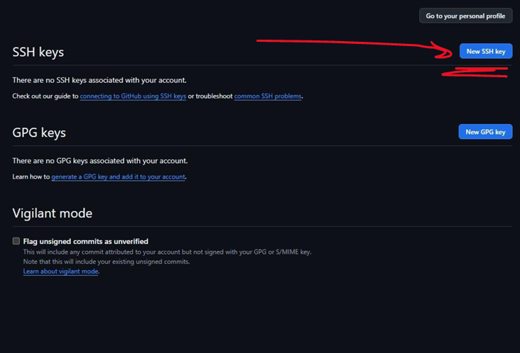
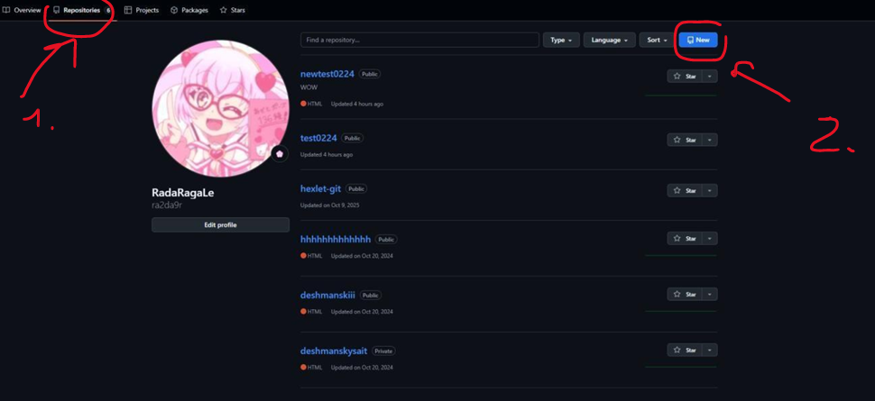
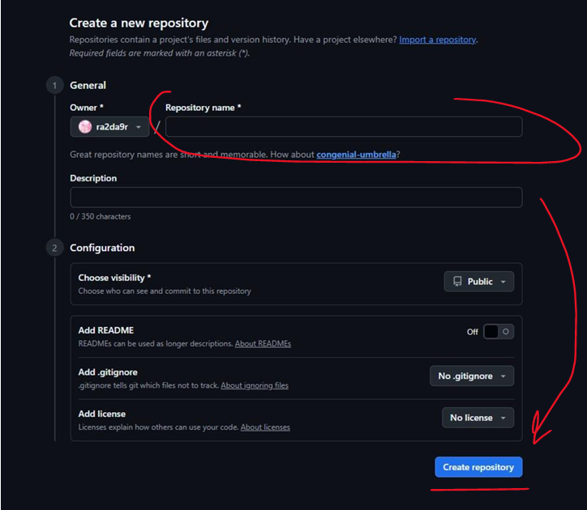
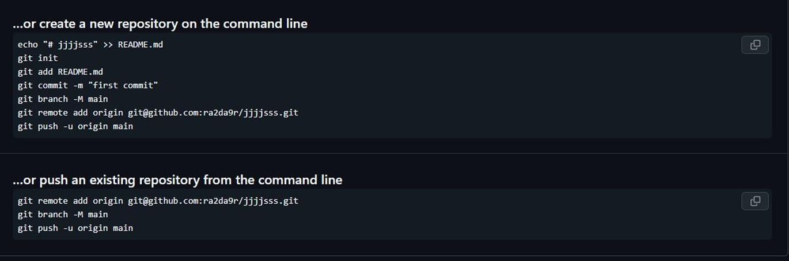
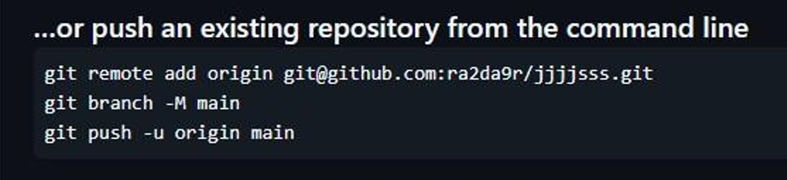

# Документация для быстрого доступа к базовой информации о пользовании ГитХабом.

## генерация публичного SSH ключа
``` bash
ssh-keygen
```

На последующие строчки нажимаем ENTER: 


Далее, вам бувдет показано, по какому пути был сохранён ваш публичный ключ


Для того, чтобы прочитать данный публичный ключ нам необходимо ввести следующую команду:
``` bash
cat ~/.ssh/id_ID_Вашего_Ключа.pub
```

И скопировать полностью следующую строчку

## ВАЖНО: НЕ СООБЩАЙТЕ НИКОМУ СВОЙ КЛЮЧ, ЭТО МОЖЕТ БЫТЬ ОПАСТНОСТИ ДЛЯ ЦЕЛОСТНОСТИ ВАШИХ ФАЙЛОВ НА ГИТХАБЕ!!!

##  Мы идём в гитхаб. 
Открываем настройки вашего профиля



Далее SHH and GPG keys



Нажимаем на кнопку New SSH key



Далее в разделе Key вставляем то, что скопировали до этого

Далее заходим в профиль и создаём новый репозиторий



Даём репозиторию имя, все остальные настройки не меняем.  
После создаём его.



Далее, в открывшимся окне видим следующее



На понадобиться всего несколько команд
``` bash
git init            
git add -A 
git commit -am”здесь любое название” 
```
И это




git init

git status

git add README.md #добавление конкретного файла для отслеживания

git commit -m 'add README.md'

ls -a # посмотреть файлы текущей директории

git clone git@github.com:<ИМЯ НА ГИТХАБЕ>/hexlet-git.git

git pull

git diff # проверка изменений в строках до добавления в индекс
git diff --staged # проверка изменений в строках после добавления в индекс

git log # простая аналитика сделанных коммитов

git log -p # Тут все коммиты с полным дифом # Промотать вперед — кнопка f, промотать назад — b # Выйти из режима просмотра — q

git show 5120bea3e5528c29f8d1da43731cbe895892eb6d # смотрим коммит по хешу

git blame INFO.md # показывает каждую строчку в файле и кто менял эту строчку
git blame <путь до файла>


git grep line # ищет совпадение с указанной строкой во всех файлах проекта
# Флаг `i` позволяет искать без учета регистра
git grep -i hexlet
# Поиск в конкретном коммите
git grep Hexlet 5120bea


# Выполняем очистку. Команда удалит все неотслеживаемые файлы
# -f – force, -d – directory
git clean -fd


# ОТМЕНА И УДАЛЕНИЕ. Но лучше двигаться вперёд а не удалять
# Отменяем изменения сделанные в файле, делаем откат к последнему коммиту
git restore INFO.md

git revert # отменяет последний коммит через создание нового
# мы можем указать отмену не только последнего коммита но и конкретного

git reset --hard HEAD~ # удаляем последний коммит, не создаём новый как в git revert
# флаг --hard полностью удаляет коммит, без него произойдёт отмена коммита и добавление изменений из коммита в директорию
# Флаг `HEAD~` означает «один коммит от последнего коммита». Короче просто последний комиит 
# `HEAD~2` значит удалить 2 последних коммита


# проваливаемся в какой то выбранный коммит
git checkout e6f625c # хеш коммита

# если мы хотим узнать где мы находимся то надо ввести
git branch
# более подробно об этой команде в 11 уроке"перемещение по истории"


# Прячем файлы
# После этой команды пропадут все измененные файлы
# независимо от того, добавлены они в индекс или нет
git stash

# Восстанавливаем после git stash
git stash pop
